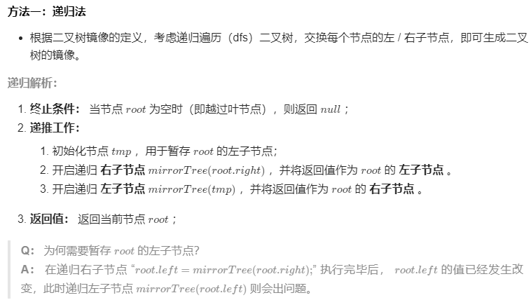
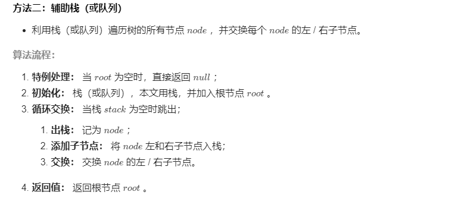

## 题目

请完成一个函数，输入一个二叉树，该函数输出它的镜像。

```java
  例如输入：
    4
   /   \
  2     7
 / \   / \
1   3 6   9
镜像输出：
     4
   /   \
  7     2
 / \   / \
9   6 3   1
```
示例 1：

输入：root = [4,2,7,1,3,6,9]
输出：[4,7,2,9,6,3,1]



```java
    public TreeNode mirrorTree(TreeNode root) {
        if(root == null) return null;
        TreeNode tmp = root.left;
        root.left = mirrorTree(root.right);
        root.right = mirrorTree(tmp);
        return root;
```




```java
 public TreeNode mirrorTree(TreeNode root) {
        if(root == null) return null;
        Stack<TreeNode> stack = new Stack<>() {{ add(root); }};
        while(!stack.isEmpty()) {
            TreeNode node = stack.pop();
            if(node.left != null) stack.add(node.left);
            if(node.right != null) stack.add(node.right);
            TreeNode tmp = node.left;
            node.left = node.right;
            node.right = tmp;
        }
        return root;
    }

```

