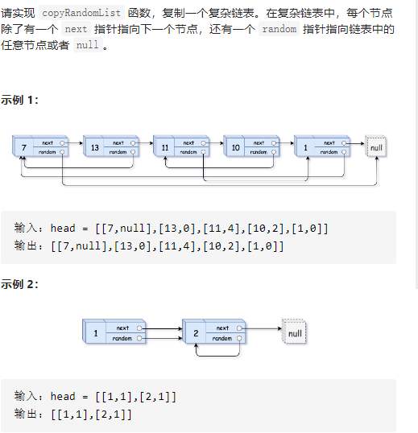

提示：

-10000 <= Node.val <= 10000
Node.random 为空（null）或指向链表中的节点。
节点数目不超过 1000 。

```java
class Solution {
    public Node copyRandomList(Node head) {
        if(head == null) return null;
        Map<Node,Node> map = new HashMap<>();
        Node cur = head;
        while(cur!= null){
            map.put(cur,new Node(cur.val));
            cur = cur.next;
        }
        cur = head;
        while(cur!=null){
            map.get(cur).next = map.get(cur.next);
            map.get(cur).random = map.get(cur.random);
            cur = cur.next;
        }
    return map.get(head);
    }
}
```

