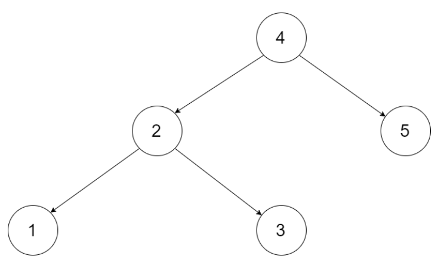
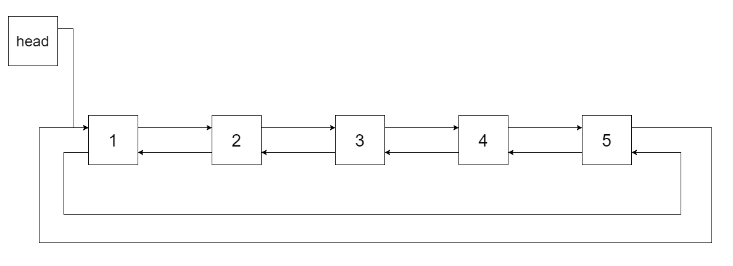

输入一棵二叉搜索树，将该二叉搜索树转换成一个排序的循环双向链表。要求不能创建任何新的节点，只能调整树中节点指针的指向。

为了让您更好地理解问题，以下面的二叉搜索树为例：



我们希望将这个二叉搜索树转化为双向循环链表。链表中的每个节点都有一个前驱和后继指针。对于双向循环链表，第一个节点的前驱是最后一个节点，最后一个节点的后继是第一个节点。

下图展示了上面的二叉搜索树转化成的链表。“head” 表示指向链表中有最小元素的节点。



特别地，我们希望可以就地完成转换操作。当转化完成以后，树中节点的左指针需要指向前驱，树中节点的右指针需要指向后继。还需要返回链表中的第一个节点的指针。

```java
class Solution {
    Node pre,head;
    public Node treeToDoublyList(Node root) {
        if(root == null) return null;
        dfs(root);
        head.left = pre;
        pre.right = head;
        return head;

    }
    public void dfs(Node cur){
        if(cur == null) return;
        dfs(cur.left);
        if(pre != null) pre.right = cur;
        else head = cur;
        cur.left = pre;
        pre = cur;
        dfs(cur.right); 
    }
}
```

