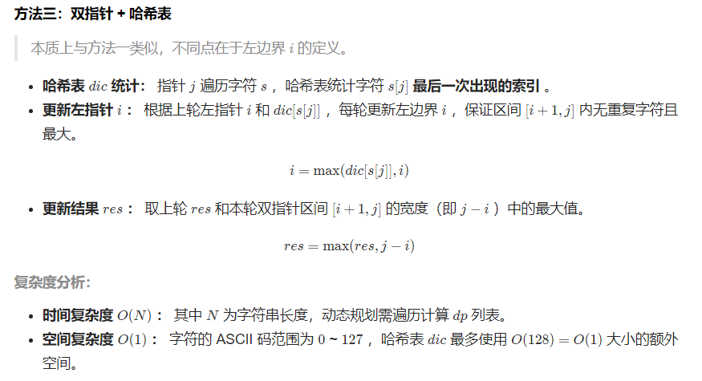

```java
//i+1到j i的初始值为-1
class Solution {
    public int lengthOfLongestSubstring(String s) {
        Map<Character, Integer> dic = new HashMap<>();
        int i = -1, res = 0;
        for(int j = 0; j < s.length(); j++) {
            if(dic.containsKey(s.charAt(j)))
                i = Math.max(i, dic.get(s.charAt(j))); // 更新左指针 i
            dic.put(s.charAt(j), j); // 哈希表记录
            res = Math.max(res, j - i); // 更新结果
        }
        return res;
    }
}
////i到j i的初始值为0
    public int lengthOfLongestSubstring(String s) {
        if (s.length() == 0)
            return 0;
        HashMap<Character, Integer> map = new HashMap<>();
        int max = 0;
        for (int i = 0, j = 0; i < s.length(); ++i) {
            if (map.containsKey(s.charAt(i))) {
                j = Math.max(j, map.get(s.charAt(i)) + 1);
            }
            map.put(s.charAt(i), i);
            max = Math.max(max, i - j + 1);
        }
        return max;
    }


```

