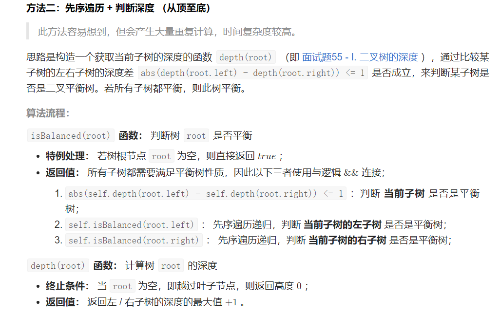
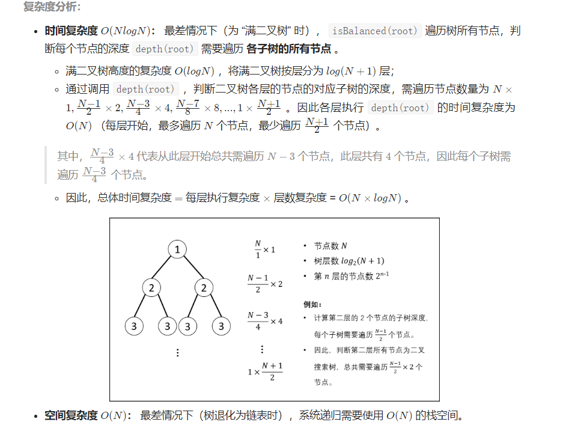

## 题目

输入一棵二叉树的根节点，判断该树是不是平衡二叉树。如果某二叉树中任意节点的左右子树的深度相差不超过1，那么它就是一棵平衡二叉树。

示例 1:

给定二叉树 [3,9,20,null,null,15,7]

        3
       / \
      9  20
        /  \
       15   7返回 true 。
示例 2:

给定二叉树 [1,2,2,3,3,null,null,4,4]

           1
      	  / \
    	 2   2
    	/ \
       3   3
      / \
     4   4

返回 false 。

限制：

0 <= 树的结点个数 <= 1000





```java
 public boolean isBalanced(TreeNode root) {
        if(root == null) return true;
        return Math.abs(dpth(root.left) - dpth(root.right)) <=1 && isBalanced(root.left) && isBalanced(root.right);
    }
    public int dpth(TreeNode root){
        if(root == null) return 0;
        return Math.max(dpth(root.left) ,dpth(root.right))+1;
    }
```

