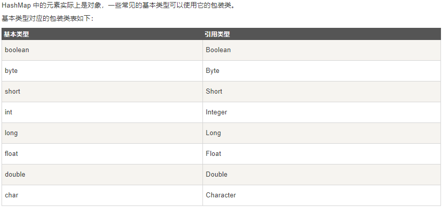
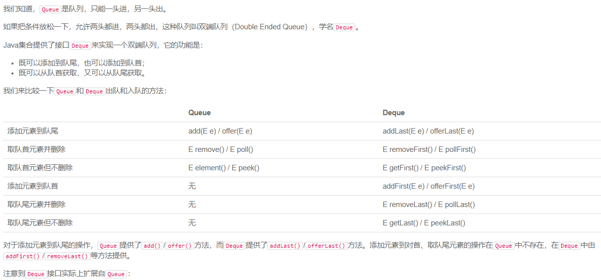
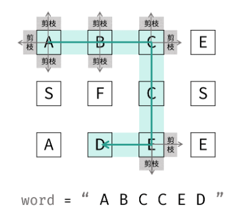
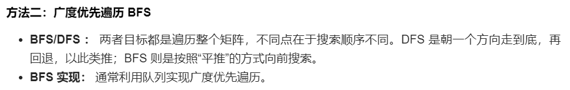

## 03 数组中重复的数字

在一个长度为 n 的数组 nums 里的所有数字都在 0～n-1 的范围内。数组中某些数字是重复的，但不知道有几个数字重复了，也不知道每个数字重复了几次。请找出数组中任意一个重复的数字。

```java
方法一：遍历插入
    class Solution {
    public int findRepeatNumber(int[] nums) {
        Set<Integer> set = new HashSet<Integer>();
        int repeat = -1;
        for (int num : nums) {
            if (!set.add(num)) {
                repeat = num;
                break;
            }
        }
        return repeat;
    }
}
```

## 04二维数组中的查找

在一个 n * m 的二维数组中，每一行都按照从左到右递增的顺序排序，每一列都按照从上到下递增的顺序排序。请完成一个高效的函数，输入这样的一个二维数组和一个整数，判断数组中是否含有该整数。


解题思路：


```java
//从右上角找,双指针
class Solution {
    public boolean findNumberIn2DArray(int[][] matrix, int target) {
        //二维数组的判空写法
        if (matrix == null || matrix.length == 0 || matrix[0].length == 0) {
            return false;
        }
        int i=0,j=matrix[0].length-1;
        while(j>=0&&i<matrix.length){
            int num = matrix[i][j];
            if(num==target)return true;
            else if(num < target) i++;
            else j--;
        }
        return false;
    }
}
```

## 05 替换空格

请实现一个函数，把字符串 `s` 中的每个空格替换成"%20"。

```java
//函数 s.replace("目标字符串"，"替换的内容");
//s.toCharArray() 转换为字符数组，s.charAt(i)遍历
//可以创建3倍大小的字符数组，最后  String newStr = new String(array字符数组, 0, size);复制就行
class Solution {
    public String replaceSpace(String s) {
        StringBuilder res = new StringBuilder();
        for(Character c : s.toCharArray())
        {
            if(c == ' ') res.append("%20");
            else res.append(c);
        }
        return res.toString();
    }
}
```

## 06从尾到头打印链表

输入一个链表的头节点，从尾到头反过来返回每个节点的值（用数组返回）。

```java
java Stack方法：
// Stack<ListNode> stack = new Stack<ListNode>();
// push()栈顶插入、pop()栈顶删除并返回，peek()栈顶返回不删除、size()大小
//Object push（Object element）：将元素推送到堆栈顶部。
//Object pop（）：移除并返回堆栈的顶部元素。如果我们在调用堆栈为空时调用pop（）,则抛出’EmptyStackException’异常。
//Object peek（）：返回堆栈顶部的元素，但不删除它。
//boolean empty（）：如果堆栈顶部没有任何内容，则返回true。否则，返回false。
//int search（Object element）：确定对象是否存在于堆栈中。如果找到该元素，它将从堆栈顶部返回元素的位置。否则，它返回-1
```


```java
class Solution {
    public int[] reversePrint(ListNode head) {
        Stack<ListNode> stack = new Stack<ListNode>();
        ListNode temp = head;
        while (temp != null) {
            stack.push(temp);
            temp = temp.next;
        }
        int size = stack.size();
        int[] print = new int[size];
        for (int i = 0; i < size; i++) {
            print[i] = stack.pop().val;
        }
        return print;
    }
}
```

## 07重建二叉树

输入某二叉树的前序遍历和中序遍历的结果，请重建该二叉树。假设输入的前序遍历和中序遍历的结果中都不含重复的数字。



```java
Java HashMap 操作：
//添加元素 put()
//访问元素 get(key)
//删除元素 remove(key)
//清空所有键值对 clear()
//计算大小 size()
//判断是否为空  isEmpty()
//检查 hashMap 中是否存在指定的 key 对应的映射关系。containsKey()
//检查 hashMap 中是否存在指定的 value 对应的映射关系 containsValue()
//替换 hashMap 中是指定的 key 对应的 value。如果 hashMap 中是否存在指定的 value 对应的映射关系返回 true，否则返回 false。
//replace(K key, V oldValue, V newValue)
//遍历
HashMap<Integer, String> Sites = new HashMap<Integer, String>();
        // 添加键值对
        Sites.put(1, "Google");
        Sites.put(2, "Runoob");
        // 输出 key 和 value
        for (Integer i : Sites.keySet()) {
            System.out.println("key: " + i + " value: " + Sites.get(i));
        }
        // 返回所有 value 值
        for(String value: Sites.values()) {
          // 输出每一个value
          System.out.print(value + ", ");
        }
    }
```


```java
//方法一 递归
//哈希表的初始化 
class Solution {
    private Map<Integer, Integer> indexMap;

    public TreeNode myBuildTree(int[] preorder, int[] inorder, int preorder_left, int preorder_right, int inorder_left, int inorder_right) {
        if (preorder_left > preorder_right) {
            return null;
        }

        // 前序遍历中的第一个节点就是根节点
        int preorder_root = preorder_left;
        // 在中序遍历中定位根节点
        int inorder_root = indexMap.get(preorder[preorder_root]);
        
        // 先把根节点建立出来
        TreeNode root = new TreeNode(preorder[preorder_root]);
        // 得到左子树中的节点数目
        int size_left_subtree = inorder_root - inorder_left;
        // 递归地构造左子树，并连接到根节点
        // 先序遍历中「从 左边界+1 开始的 size_left_subtree」个元素就对应了中序遍历中「从 左边界 开始到 根节点定位-1」的元素
        root.left = myBuildTree(preorder, inorder, preorder_left + 1, preorder_left + size_left_subtree, inorder_left, inorder_root - 1);
        // 递归地构造右子树，并连接到根节点
        // 先序遍历中「从 左边界+1+左子树节点数目 开始到 右边界」的元素就对应了中序遍历中「从 根节点定位+1 到 右边界」的元素
        root.right = myBuildTree(preorder, inorder, preorder_left + size_left_subtree + 1, preorder_right, inorder_root + 1, inorder_right);
        return root;
    }

    public TreeNode buildTree(int[] preorder, int[] inorder) {
        int n = preorder.length;
        // 构造哈希映射，帮助我们快速定位根节点
        indexMap = new HashMap<Integer, Integer>();
        for (int i = 0; i < n; i++) {
            indexMap.put(inorder[i], i);
        }
        return myBuildTree(preorder, inorder, 0, n - 1, 0, n - 1);
    }
}
```

## 09用两个栈实现队列

用两个栈实现一个队列。队列的声明如下，请实现它的两个函数 appendTail 和 deleteHead ，分别完成在队列尾部插入整数和在队列头部删除整数的功能。(若队列中没有元素，deleteHead 操作返回 -1 )

```java
//双端队列--Deque 
```



```java
//判断栈是否为空 不能 == null 要用isEmpty()
//官方用的是双端链表
class CQueue {
    Deque<Integer> stack1;
    Deque<Integer> stack2;
    public CQueue() {
        stack1 = new LinkedList<Integer>();
        stack2 = new LinkedList<Integer>();
    }
    public void appendTail(int value) {
        stack1.push(value);
    }
    public int deleteHead() {
        // 如果第二个栈为空
        if (stack2.isEmpty()) {
            while (!stack1.isEmpty()) {
                stack2.push(stack1.pop());
            }
        } 
        if (stack2.isEmpty()) {
            return -1;
        } else {
            int deleteItem = stack2.pop();
            return deleteItem;
        }
    }
}
//栈方法
class CQueue {
    Stack<Integer> stack1;
    Stack<Integer> stack2;
    public CQueue() {
        stack1 = new Stack<Integer>();
        stack2 = new Stack<Integer>();
    }
    
    public void appendTail(int value) {
        stack1.push(value);
    }
    
    public int deleteHead() {
        int res = 0;
        if(stack2.isEmpty()){
            while(!stack1.isEmpty()){
                stack2.push(stack1.pop());
            }
        }
        if(stack2.isEmpty()){
             return -1;
        }else res = stack2.pop();

        return res;
    }
}
```

## 10 _1斐波那契数列

写一个函数，输入 n ，求斐波那契（Fibonacci）数列的第 n 项（即 F(N)）。斐波那契数列的定义如下：

F(0) = 0,   F(1) = 1
F(N) = F(N - 1) + F(N - 2), 其中 N > 1.

```java
//递归方法 出现 超出时间限制错误
class Solution {
    public int fib(int n) {
        if(n==0) return 0;
        if(n==1) return 1;
        return (fib(n-1)+fib(n-2))%1000000007;
    }
}
//动态规划
// 动态规划关键思路：dp 列表第 i 项只与第 i-1 和第 i-2 项有关
//dp[i + 1] = dp[i] + dp[i - 1]dp[i+1]=dp[i]+dp[i−1]
class Solution {
    public int fib(int n) {
        int a = 0, b = 1, sum;
        for(int i = 0; i < n; i++){
            sum = (a + b) % 1000000007;
            a = b;
            b = sum;
        }
        return a;
    }
}
```

## 10_2青蛙跳台阶问题

一只青蛙一次可以跳上1级台阶，也可以跳上2级台阶。求该青蛙跳上一个 `n` 级的台阶总共有多少种跳法。答案需要取模 1e9+7（1000000007），如计算初始结果为：1000000008，请返回 1。

动态规划思路：


```java
class Solution {
    public int numWays(int n) {
        if(n==0) return 1;
        int a=1,b=2,sum=0;
        for(int i=2;i<=n;i++){
            sum=(a+b)%1000000007;
            a=b;
            b=sum;
        }
        return a;
    }
}
```

## 11旋转数组的最小数字

把一个数组最开始的若干个元素搬到数组的末尾，我们称之为数组的旋转。输入一个递增排序的数组的一个旋转，输出旋转数组的最小元素。例如，数组 [3,4,5,1,2] 为 [1,2,3,4,5] 的一个旋转，该数组的最小值为1。 

```java
//思路：二分法（直接排序找最小也可以）
class Solution {
    public int minArray(int[] numbers) {
       int i=0,j=numbers.length-1,m=0;
        while(i<j){
            m = (i+j)/2;
            if(numbers[m]<numbers[j]) j=m;
            else if(numbers[m]>numbers[j]) i=m+1;
            else j--;//相等时不能确定最小值在哪一部分，由于此时的j有m替代，忽略右端点
        }
        return numbers[i];
    }
}
```

## 12矩阵中的路径

请设计一个函数，用来判断在一个矩阵中是否存在一条包含某字符串所有字符的路径。路径可以从矩阵中的任意一格开始，每一步可以在矩阵中向左、右、上、下移动一格。如果一条路径经过了矩阵的某一格，那么该路径不能再次进入该格子。例如，在下面的3×4的矩阵中包含一条字符串“bfce”的路径（路径中的字母用加粗标出）。

[["a","b","c","e"],
["s","f","c","s"],
["a","d","e","e"]]

但矩阵中不包含字符串“abfb”的路径，因为字符串的第一个字符b占据了矩阵中的第一行第二个格子之后，路径不能再次进入这个格子。

**思路：**本问题是典型的矩阵搜索问题，可使用 **深度优先搜索（DFS）+回溯+ 剪枝** 解决。
**深度优先搜索**： 可以理解为暴力法遍历矩阵中所有字符串可能性。DFS 通过递归，先朝一个方向搜到底，再回溯至上个节点，沿另一个方向搜索，以此类推。
**剪枝**： 在搜索中，遇到 这条路不可能和目标字符串匹配成功 的情况（例如：此矩阵元素和目标字符不同、此元素已被访问），则应立即返回，称之为 可行性剪枝 。



```java
//DFS搜索时分四步：1.递归参数2.终止条件3.递推工作4.返回值
//不回溯，可能造成分支污染
class Solution {
    public boolean exist(char[][] board, String word) {
        char words[] = word.toCharArray();
        for(int i=0;i<board.length;i++){
            for(int j=0;j<board[0].length;j++){
                if(dfs(board,words,i,j,0)) return true;
            }
        }
        return false;
    }
    public boolean dfs(char[][] board,char [] words,int i,int j,int k){
        if(i<0||i>=board.length||j<0||j>=board[0].length||board[i][j]!=words[k]) return false;
        if(k==words.length-1) return true;
        board[i][j] = '\0';
        boolean res = dfs(board,words,i-1,j,k+1)||
                      dfs(board,words,i,j-1,k+1)||
                      dfs(board,words,i,j+1,k+1)||
                      dfs(board,words,i+1,j,k+1);
        board[i][j] = words[k];
        return res;
    }
}

```

## 13机器人运动范围

地上有一个m行n列的方格，从坐标 [0,0] 到坐标 [m-1,n-1] 。一个机器人从坐标 [0, 0] 的格子开始移动，它每次可以向左、右、上、下移动一格（不能移动到方格外），也不能进入行坐标和列坐标的数位之和大于k的格子。例如，当k为18时，机器人能够进入方格 [35, 37] ，因为3+5+3+7=18。但它不能进入方格 [35, 38]，因为3+5+3+8=19。请问该机器人能够到达多少个格子？

```java
//DFS + 剪枝 ；关键在于搜索方向变为向右或者向下
//写法一：
class Solution {
    int res;
    int k;
    boolean memary[][] ;
    public int movingCount(int m, int n, int k) {
        memary = new boolean[m][n];
        res = 0;
        this.k = k;
        dfs(m,n,0,0);
        return res;
    }
    public void dfs(int m,int n,int i,int j){
        int t = i%10+i/10+i/100+j%10+j/10+j/100;
        if(i>m-1||j>n-1||memary[i][j]) return;
        if(t>k) return;
        memary[i][j] = true;
        res++;
        dfs(m,n,i+1,j);
        dfs(m,n,i,j+1);

    }
}
//写法二：
class Solution {
    int m, n, k;
    boolean[][] visited;
    public int movingCount(int m, int n, int k) {
        this.m = m; this.n = n; this.k = k;
        this.visited = new boolean[m][n];
        return dfs(0, 0, 0, 0);
    }
    public int dfs(int i, int j, int si, int sj) {
        if(i >= m || j >= n || k < si + sj || visited[i][j]) return 0;
        visited[i][j] = true;
        return 1 + dfs(i + 1, j, (i + 1) % 10 != 0 ? si + 1 : si - 8, sj) + dfs(i, j + 1, si, (j + 1) % 10 != 0 ? sj + 1 : sj - 8);
    }
}
```



```java
class Solution {
public int movingCount(int m, int n, int k) {
    //临时变量visited记录格子是否被访问过
    boolean[][] visited = new boolean[m][n];
    int res = 0;
    //创建一个队列，保存的是访问到的格子坐标，是个二维数组
    Queue<int[]> queue = new LinkedList<>();
    // 把起始结点存入队列
    queue.add(new int[]{0, 0});
    while (queue.size() > 0) {
        // 将队列的第一个结点出队，访问
        int[] temp = queue.poll();
        int x = temp[0], y = temp[1];
        // 不合格的坐标格子
        if (x >= m || y >= n || get(x) + get(y) > k || visited[x][y])
            continue;
        // 将格子标记为已经访问过
        visited[x][y] = true;
        // 满足条件的格子数加一
        res++;
        // 向右边移动
        queue.add(new int[]{x + 1, y});
        // 向下移动
        queue.add(new int[]{x, y + 1});
    }
    return res;
}

// 计算一个数的各个位数之和
    private int get(int x) {
        int res = 0;
        while (x != 0) {
            res += x % 10;
            x /= 10;
        }
        return res;
    }
}
```

