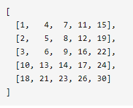
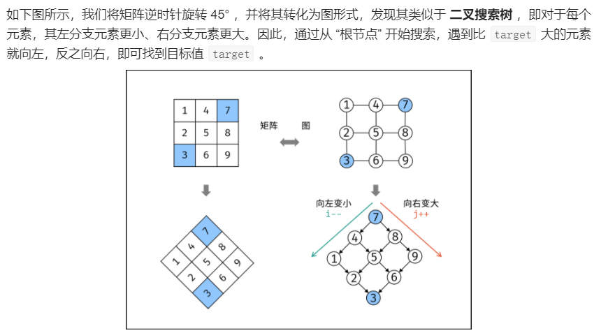

## 03 数组中重复的数字

在一个长度为 n 的数组 nums 里的所有数字都在 0～n-1 的范围内。数组中某些数字是重复的，但不知道有几个数字重复了，也不知道每个数字重复了几次。请找出数组中任意一个重复的数字。

```java
方法一：遍历插入
    class Solution {
    public int findRepeatNumber(int[] nums) {
        Set<Integer> set = new HashSet<Integer>();
        int repeat = -1;
        for (int num : nums) {
            if (!set.add(num)) {
                repeat = num;
                break;
            }
        }
        return repeat;
    }
}
```

## 04二维数组中的查找

在一个 n * m 的二维数组中，每一行都按照从左到右递增的顺序排序，每一列都按照从上到下递增的顺序排序。请完成一个高效的函数，输入这样的一个二维数组和一个整数，判断数组中是否含有该整数。



解题思路：



```java
//从右上角找,双指针
class Solution {
    public boolean findNumberIn2DArray(int[][] matrix, int target) {
        //二维数组的判空写法
        if (matrix == null || matrix.length == 0 || matrix[0].length == 0) {
            return false;
        }
        int i=0,j=matrix[0].length-1;
        while(j>=0&&i<matrix.length){
            int num = matrix[i][j];
            if(num==target)return true;
            else if(num < target) i++;
            else j--;
        }
        return false;
    }
}
```

## 05 替换空格

请实现一个函数，把字符串 `s` 中的每个空格替换成"%20"。

```java
//函数 s.replace("目标字符串"，"替换的内容");
//s.toCharArray() 转换为字符数组，s.charAt(i)遍历
//可以创建3倍大小的字符数组，最后  String newStr = new String(array字符数组, 0, size);复制就行
class Solution {
    public String replaceSpace(String s) {
        StringBuilder res = new StringBuilder();
        for(Character c : s.toCharArray())
        {
            if(c == ' ') res.append("%20");
            else res.append(c);
        }
        return res.toString();
    }
}
```

## 06从尾到头打印链表

输入一个链表的头节点，从尾到头反过来返回每个节点的值（用数组返回）。

```java
// push()栈顶插入、pop()栈顶删除并返回，peek()栈顶返回不删除、size()大小
//Object push（Object element）：将元素推送到堆栈顶部。
//Object pop（）：移除并返回堆栈的顶部元素。如果我们在调用堆栈为空时调用pop（）,则抛出’EmptyStackException’异常。
//Object peek（）：返回堆栈顶部的元素，但不删除它。
//boolean empty（）：如果堆栈顶部没有任何内容，则返回true。否则，返回false。
//int search（Object element）：确定对象是否存在于堆栈中。如果找到该元素，它将从堆栈顶部返回元素的位置。否则，它返回-1
class Solution {
    public int[] reversePrint(ListNode head) {
        Stack<ListNode> stack = new Stack<ListNode>();
        ListNode temp = head;
        while (temp != null) {
            stack.push(temp);
            temp = temp.next;
        }
        int size = stack.size();
        int[] print = new int[size];
        for (int i = 0; i < size; i++) {
            print[i] = stack.pop().val;
        }
        return print;
    }
}
```

